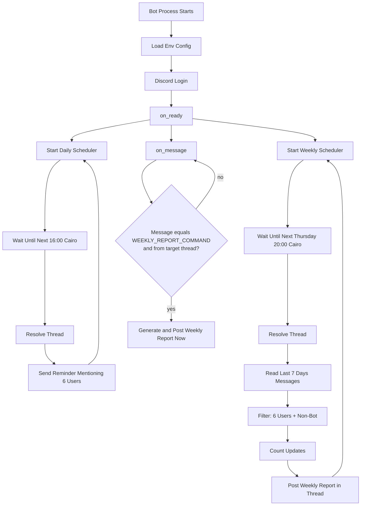
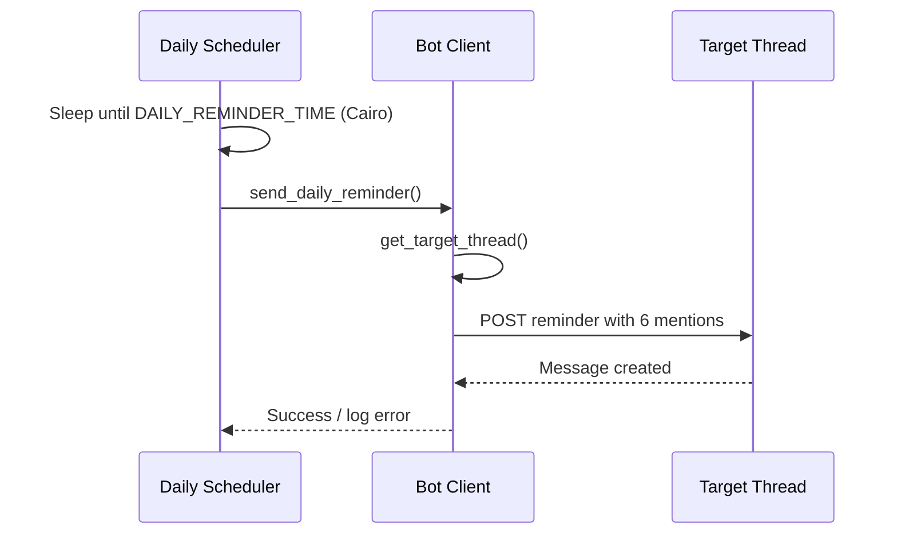
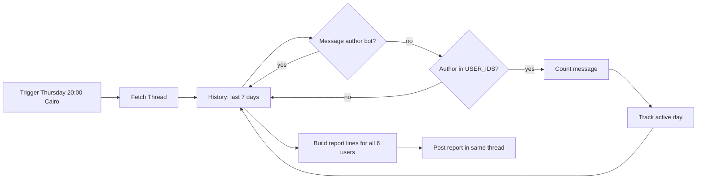
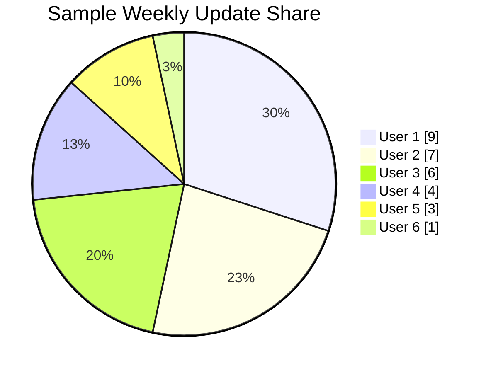

# Discord Automation Bot

Lightweight Discord bot built with `discord.py` to automate:

- Daily reminder (mentions 6 users in a specific thread)
- Weekly report every Thursday 8:00 PM (`Africa/Cairo`)
- Report generation from one thread only
- On-demand weekly report command at any time
- Simple free-tier deployment (Railway / Render)

## Features

- Python 3.10+
- No database
- Uses message history scan for the last 7 days
- Ignores bot messages in counting
- Always includes all 6 users in weekly report (including `0`)
- Handles empty thread safely
- Supports manual weekly report generation from thread command
- Logs clear errors for thread lookup and missing permissions
- Resumes schedulers automatically after process restart

## Architecture (Flowchart)



## Daily Reminder Sequence



## Weekly Reporting Pipeline



## Example Weekly Distribution (Sample Chart)



## Message Formats

Daily:

```text
<@user1> <@user2> <@user3> <@user4> <@user5> <@user6>
Daily reminder: Please post your update.
```

Weekly:

```text
\U0001F4CA Weekly Report

<@user1> : X updates
<@user2> : X updates
...
<@user6> : X updates
```

Manual trigger:

```text
!weekly_report
```

Post the command in the configured thread to generate the weekly report immediately.

## Configuration

Set environment variables in your host platform (or local shell).
You can start from `.env.example`.

| Variable | Required | Default | Description |
|---|---|---|---|
| `BOT_TOKEN` | Yes | - | Discord bot token |
| `THREAD_ID` | Yes | - | Target Discord thread ID |
| `USER_IDS` | Yes | - | Comma-separated list of exactly 6 user IDs |
| `DAILY_REMINDER_TIME` | No | `16:00` | Daily reminder time (`HH:MM`, Cairo local time) |
| `WEEKLY_REPORT_TIME` | No | `20:00` | Weekly report time (`HH:MM`, Cairo local time) |
| `WEEKLY_REPORT_COMMAND` | No | `!weekly_report` | Command that triggers weekly report on demand in thread |
| `TIMEZONE` | No | `Africa/Cairo` | IANA timezone name |
| `ONE_UPDATE_PER_DAY` | No | `false` | Optional dedupe: max 1 update per user per day |
| `RANK_REPORT` | No | `false` | Optional ranking by update count |
| `INCLUDE_MISSED_DAYS` | No | `false` | Optional `Missed Days` in weekly lines |
| `LOG_LEVEL` | No | `INFO` | Logging verbosity |

## Permissions Required

Grant the bot these permissions in the server/thread context:

- View Channels
- Send Messages
- Read Message History

If permissions are missing, the bot logs a clear error and continues running.

## Local Run

1. Install dependencies:
```powershell
pip install -r requirements.txt
```

2. Export variables (example in PowerShell):
```powershell
$env:BOT_TOKEN="your-token"
$env:THREAD_ID="123456789012345678"
$env:USER_IDS="111111111111111111,222222222222222222,333333333333333333,444444444444444444,555555555555555555,666666666666666666"
$env:DAILY_REMINDER_TIME="16:00"
$env:WEEKLY_REPORT_TIME="20:00"
$env:WEEKLY_REPORT_COMMAND="!weekly_report"
$env:TIMEZONE="Africa/Cairo"
```

3. Start:
```powershell
python main.py
```

## Deployment

### Railway

1. Create new project from repo/folder.
2. Set environment variables listed above.
3. Start command:
```text
python main.py
```
4. Ensure service root is `mindrift_tasks/discord_bot` (or adjust command path).

### Render

1. Create a new `Web Service` or `Background Worker` from repo.
2. Runtime: Python 3.10+.
3. Build command:
```text
pip install -r requirements.txt
```
4. Start command:
```text
python main.py
```
5. Add required environment variables.

## Operational Notes

- Weekly report runs once per Thursday based on scheduler sleep-to-next-run logic.
- Manual weekly report can be requested any time using `WEEKLY_REPORT_COMMAND` in the target thread.
- After host restarts, next run is recalculated from current Cairo time.
- No persistent state is required.
- Empty thread produces a valid report with all users at `0`.

## Files

- `main.py`: bot runtime, schedulers, config parsing, report generation
- `requirements.txt`: dependencies (`discord.py`, `tzdata`)
- `.env.example`: ready-to-edit configuration template
